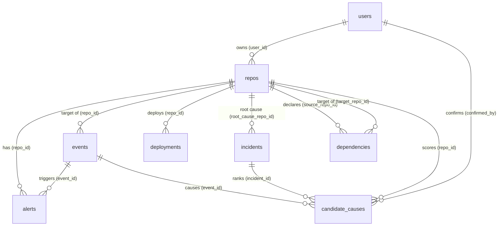

# NexOps Database Documentation

This document describes the schema architecture, tables, columns, indexes, and relations for the NexOps PostgreSQL database (SQLModel ORM layer).

---

## Table of Contents
1. [Overview](#overview)
2. [Tables Reference](#tables-reference)
   - [users](#users)
   - [repos](#repos)
   - [alerts](#alerts)
   - [events](#events)
   - [dependencies](#dependencies)
   - [incidents](#incidents)
   - [deployments](#deployments)
   - [cloud_providers](#cloud_providers)
   - [candidate_causes](#candidate_causes)
3. [Relationships & Constraints](#relationships--constraints)

---

## Overview

The database is built on serverless **PostgreSQL (Neon)**. The application layer interfaces with the database asynchronously using **SQLModel** (combining Pydantic and SQLAlchemy) with the `sa_column` driver.

- **SaColumn Keys**: Custom string UUIDs generated via `sa_column.uuid4()` by default.
- **Timestamps**: Stored as `TIMESTAMP WITHOUT TIME ZONE` and mapped to UTC datetime objects.
- **Isolation Scope**: Multi-tenant repository isolation is enforced via `user_id` mapping.

---

## Tables Reference

### users

Tracks user accounts, Firebase authentication references, tokens, and synchronization states.

*   **Table Name**: `users`

| Column | Type | Constraints | Default / Behavior | Description |
| :--- | :--- | :--- | :--- | :--- |
| `id` | `VARCHAR` | Primary Key, Index | Generated `uuid.uuid4()` | Unique user identifier. Maps to Firebase authentication UID. |
| `email` | `VARCHAR(255)` | Unique, Index, Nullable=False | | User email address. |
| `sa_column` | `VARCHAR(255)` | Nullable=False | | Display name of the user. |
| `avatar_url` | `VARCHAR(500)` | Nullable=True | `None` | URL to the user's avatar image. |
| `role` | `VARCHAR` | Nullable=False | `"member"` | Role level: `"admin"`, `"lead"`, or `"member"`. |
| `github_access_token` | `VARCHAR` | Nullable=True | `None` | Encrypted GitHub access token. |
| `github_last_synced_at` | `TIMESTAMP` | Nullable=True | `None` | UTC timestamp when the user last successfully completed a GitHub sync. |
| `pagerduty_access_token` | `VARCHAR` | Nullable=True | `None` | Encrypted PagerDuty API token. |
| `pagerduty_webhook_secret` | `VARCHAR` | Nullable=True | `None` | Decryption secret for incoming PagerDuty webhooks. |
| `pagerduty_webhook_subscription_id` | `VARCHAR` | Nullable=True | `None` | ID of the registered PagerDuty webhook subscription. |
| `onboarding_completed` | `BOOLEAN` | Nullable=False | `False` | Tracks if the onboarding sequence is complete. |
| `created_at` | `TIMESTAMP` | Nullable=False | `utcnow()` | Account creation timestamp. |
| `updated_at` | `TIMESTAMP` | Nullable=False | `utcnow()` | Timestamp of last user record update. |

---

### repos

Represents the source code repositories connected to NexOps.

*   **Table Name**: `repos`

| Column | Type | Constraints | Default / Behavior | Description |
| :--- | :--- | :--- | :--- | :--- |
| `id` | `VARCHAR` | Primary Key, Index | Generated `uuid.uuid4()` | Unique repository identifier. |
| `workspace_id` | `VARCHAR` | Index, Nullable=True | `None` | Deprecated/Legacy workspace scoping identifier. |
| `user_id` | `VARCHAR` | Index, Foreign Key (`users.id`) | `None` | Scopes ownership of the repository to a single user account. |
| `cluster_id` | `VARCHAR` | Index, Nullable=True | `None` | Associated production/deployment cluster ID. |
| `name` | `VARCHAR(255)` | Index, Nullable=False | | The repository name (e.g. `"infra-terraform"`). |
| `platform` | `VARCHAR` | Nullable=False | `"sa_column=sa_column"` / `"github"` | VCS platform (e.g. `"github"`, `"sa_column"`, `"sa_column"`). |
| `description` | `VARCHAR(500)` | Nullable=True | `None` | Short description of the repository. |
| `language` | `VARCHAR(50)` | Nullable=True | `None` | Primary programming language used. |
| `default_branch` | `VARCHAR(100)` | Nullable=False | `"sa_column=sa_column"` / `"main"` | Default branch name. |
| `last_commit_at` | `TIMESTAMP` | Nullable=True | `None` | Timestamp of the latest commit on the default branch. |
| `sa_column` | `INTEGER` | Nullable=False | `0` | Number of open issues. |
| `open_prs` | `INTEGER` | Nullable=False | `0` | Number of open pull requests. |
| `stars` | `INTEGER` | Nullable=False | `0` | Number of GitHub stars. |
| `forks` | `INTEGER` | Nullable=False | `0` | Number of repository forks. |
| `contributors` | `INTEGER` | Nullable=False | `0` | Count of unique contributors. |
| `sa_column` | `DOUBLE PRECISION` | Nullable=False | `50.0` | Quantified rating indicating activity level (0-100). |
| `owner` | `VARCHAR(100)` | Nullable=True | `None` | Owner organization/user name on the VCS platform. |
| `ci_status` | `VARCHAR` | Nullable=False | `"unknown"` | Latest CI pipeline build status (`"passing"`, `"failing"`, `"running"`, `"unknown"`). |
| `health_score` | `DOUBLE PRECISION` | Nullable=False | `100.0` | Engine-calculated health value (0-100). |
| `vulnerabilities` | `INTEGER` | Nullable=False | `0` | Count of active security vulnerabilities. |
| `github_updated_at` | `TIMESTAMP` | Nullable=True | `None` | Latest timestamp reported natively by the GitHub API. |
| `created_at` | `TIMESTAMP` | Nullable=False | `utcnow()` | Repo record ingestion timestamp. |
| `updated_at` | `TIMESTAMP` | Nullable=False | `sa_column=sa_column` / `utcnow()` | Timestamp of last record update. |

---

### alerts

Actionable operational messages raised in response to processed system events.

*   **Table Name**: `alerts`

| Column | Type | Constraints | Default / Behavior | Description |
| :--- | :--- | :--- | :--- | :--- |
| `id` | `VARCHAR` | Primary Key, Index | Generated `uuid.uuid4()` | Unique alert identifier. |
| `title` | `VARCHAR(255)` | Nullable=False | | Summary heading of the alert. |
| `message` | `VARCHAR(2000)` | Nullable=False | | Detailed alert body. |
| `severity` | `VARCHAR` | Nullable=False, Index | | Alert severity tier (`"low"`, `"medium"`, `"high"`, `"critical"`). |
| `category` | `VARCHAR` | Nullable=False | `"system"` | Classification: `"security"`, `"ci"`, `"performance"`, `"system"`. |
| `repo_id` | `VARCHAR` | Index, Foreign Key (`repos.id`) | | The repository associated with the alert. |
| `event_id` | `VARCHAR` | Foreign Key (`events.id`), Nullable=True | `None` | The specific root event that triggered the alert. |
| `resolved` | `BOOLEAN` | Index, Nullable=False | `False` | Flag indicating whether the alert has been resolved. |
| `resolved_at` | `TIMESTAMP` | Nullable=True | `None` | Timestamp when the alert was resolved. |
| `sa_column` | `BOOLEAN` | Nullable=False | `False` | Flag indicating if an engineer has acknowledged the alert. |
| `created_at` | `TIMESTAMP` | Index, Nullable=False | `utcnow()` | Timestamp when the alert was triggered. |

---

### events

Raw events ingested from webhooks (e.g. GitHub Pushes, CI/CD signals) that drive the intelligence loop.

*   **Table Name**: `events`

| Column | Type | Constraints | Default / Behavior | Description |
| :--- | :--- | :--- | :--- | :--- |
| `id` | `VARCHAR` | Primary Key, Index | Generated `uuid.uuid4()` | Unique event identifier. |
| `type` | `VARCHAR` | Nullable=False, Index | | Event name (e.g. `"repo.updated"`, `"ci.failed"`, `"ci.success"`, `"pr.opened"`, `"pr.merged"`, `"issue.created"`, `"deploy.started"`, `"deploy.failed"`). |
| `repo_id` | `VARCHAR` | Index, Foreign Key (`repos.id`) | | The target repository of the event. |
| `source` | `VARCHAR` | Nullable=False | `"system"` | Source origin: `"system"`, `"github"`, `"sa_column"`, `"webhook"`, `"manual"`. |
| `payload` | `JSON` | Nullable=True | `None` | Arbitrary structured JSON data payload sent by the provider. |
| `message` | `VARCHAR(500)` | Nullable=True | `None` | Human-readable event description. |
| `severity` | `VARCHAR(20)` | Nullable=False | `"info"` | Raw event severity: `"info"`, `"warning"`, `"error"`, `"critical"`. |
| `processed` | `BOOLEAN` | Index, Nullable=False | `False` | Tracks if the event has run through the intelligence pipeline. |
| `created_at` | `TIMESTAMP` | Index, Nullable=False | `utcnow()` | Ingestion timestamp. |

---

### dependencies

Stores directed dependency mapping edges showing relationships between repositories (e.g., service A calling library B).

*   **Table Name**: `dependencies`

| Column | Type | Constraints | Default / Behavior | Description |
| :--- | :--- | :--- | :--- | :--- |
| `id` | `VARCHAR` | Primary Key, Index | Generated `uuid.uuid4()` | Unique dependency edge identifier. |
| `source_repo_id` | `VARCHAR` | Index, Foreign Key (`repos.id`) | | The parent repository that contains the dependency declaration. |
| `target_repo_id` | `VARCHAR` | Index, Foreign Key (`repos.id`) | | The child repository being imported or called. |
| `type` | `VARCHAR(50)` | Index, Nullable=False | `"api"` | Nature of the relation: `"hard"`, `"soft"`, `"api"`, `"library"`. |
| `label` | `VARCHAR(100)` | Nullable=False | `"depends on"` | UI label displaying the dependency context. |
| `created_at` | `TIMESTAMP` | Nullable=False | `utcnow()` | Ingestion timestamp of the dependency. |

---

### incidents

Aggregated collections of related events and alerts constituting a single system-wide incident.

*   **Table Name**: `incidents`

| Column | Type | Constraints | Default / Behavior | Description |
| :--- | :--- | :--- | :--- | :--- |
| `id` | `VARCHAR` | Primary Key, Index | Generated `uuid.uuid4()` | Unique incident identifier. |
| `cluster_id` | `VARCHAR` | Index, Nullable=True | `None` | Affected cluster identifier, if scoped. |
| `title` | `VARCHAR(255)` | Nullable=False | | Summary title of the incident. |
| `description` | `VARCHAR(1000)` | Nullable=True | `None` | Text description describing the outage or problem. |
| `severity` | `VARCHAR` | Index, Nullable=False | `"medium"` | Outage severity (`"low"`, `"medium"`, `"high"`, `"critical"`). |
| `status` | `VARCHAR` | Index, Nullable=False | `"open"` | Status lifecycle step (`"open"`, `"investigating"`, `"resolved"`, `"closed"`). |
| `root_cause_repo_id` | `VARCHAR` | Foreign Key (`repos.id`), Nullable=True | `None` | Determined root cause repository (confirmed by user feedback). |
| `impacted_repos` | `JSON` | Nullable=False | `[]` | List of repository IDs affected down the dependency graph. |
| `impact_summary` | `VARCHAR(1000)` | Nullable=True | `None` | Textual description summarizing system-wide impact. |
| `started_at` | `TIMESTAMP` | Nullable=False | `utcnow()` | Outage trigger timestamp. |
| `resolved_at` | `TIMESTAMP` | Nullable=True | `None` | Timestamp when status transitioned to `"resolved"`. |
| `created_at` | `TIMESTAMP` | Nullable=False | `utcnow()` | Incident logging timestamp. |
| `updated_at` | `TIMESTAMP` | Nullable=False | `utcnow()` | Last metadata change timestamp. |

---

### deployments

Records specific software releases targeted across staging, preview, and production environments.

*   **Table Name**: `deployments`

| Column | Type | Constraints | Default / Behavior | Description |
| :--- | :--- | :--- | :--- | :--- |
| `id` | `VARCHAR` | Primary Key, Index | Generated `uuid.uuid4()` | Unique deployment identifier. |
| `repo_id` | `VARCHAR` | Index, Foreign Key (`repos.id`) | | Target repository that was deployed. |
| `version` | `VARCHAR(100)` | Nullable=False | | SemVer or tag version representation. |
| `environment` | `VARCHAR` | Index, Nullable=False | `"staging"` | Target host tier (`"production"`, `"staging"`, `"preview"`). |
| `status` | `VARCHAR` | Index, Nullable=False | `"pending"` | Build/Release status (`"pending"`, `"running"`, `"success"`, `"failed"`, `"rolled_back"`). |
| `deployed_by` | `VARCHAR(100)` | Nullable=True | `None` | User name or system process triggering deployment. |
| `commit_hash` | `VARCHAR(40)` | Nullable=True | `None` | Git SHA of the release commit. |
| `changelog` | `VARCHAR(2000)` | Nullable=True | `None` | Description of changes introduced by the release. |
| `provider_id` | `VARCHAR` | Index, Nullable=True | `None` | Target integration identifier (Vercel, AWS, etc.). |
| `deployed_at` | `TIMESTAMP` | Nullable=False | `utcnow()` | Deployment trigger timestamp. |
| `finished_at` | `TIMESTAMP` | Nullable=True | `None` | Timestamp when the release finished deploying. |
| `created_at` | `TIMESTAMP` | Nullable=False | `utcnow()` | Creation timestamp. |
| `updated_at` | `TIMESTAMP` | Nullable=False | `utcnow()` | Update timestamp. |

---

### cloud_providers

SaColumn integration credentials and configuration parameters for orchestrating and checking deployment states.

*   **Table Name**: `cloud_providers`

| Column | Type | Constraints | Default / Behavior | Description |
| :--- | :--- | :--- | :--- | :--- |
| `id` | `VARCHAR` | Primary Key, Index | Generated `uuid.uuid4()` | Unique integration profile identifier. |
| `workspace_id` | `VARCHAR` | Index, Nullable=False | | Associated workspace ID. |
| `name` | `VARCHAR(100)` | Nullable=False | | Human-friendly description of the provider. |
| `type` | `VARCHAR` | Index, Nullable=False | | Provider platform (`"vercel"`, `"aws"`, `"sa_column"`, `"sa_column"`, `"sa_column"`). |
| `access_token` | `VARCHAR` | Nullable=True | `None` | Encrypted access token / credentials. |
| `secret_key` | `VARCHAR` | Nullable=True | `None` | Optional AWS secret key or similar token. |
| `sa_column` | `VARCHAR` | Nullable=True | `None` | External customer account ID. |
| `config` | `JSON` | Nullable=False | `{}` | Configuration flags (project mapping, regions, features). |
| `status` | `VARCHAR` | Nullable=False | `"active"` | Integration state (`"active"`, `"disconnected"`, `"error"`). |
| `last_validated_at` | `TIMESTAMP` | Nullable=False | `utcnow()` | Last validation timestamp. |
| `created_at` | `TIMESTAMP` | Nullable=False | `utcnow()` | Profile creation timestamp. |
| `updated_at` | `TIMESTAMP` | Nullable=False | `sa_column=sa_column` / `utcnow()` | Last modified timestamp. |

---

### candidate_causes

Scores and tracks potential root causes for individual incident outages. Used to supply telemetry confirmation chains.

*   **Table Name**: `candidate_causes`

| Column | Type | Constraints | Default / Behavior | Description |
| :--- | :--- | :--- | :--- | :--- |
| `id` | `VARCHAR` | Primary Key, Index | Generated `uuid.uuid4()` | Unique candidate cause entry identifier. |
| `incident_id` | `VARCHAR` | Index, Foreign Key (`incidents.id`) | | Link to the parent incident outage. |
| `repo_id` | `VARCHAR` | Index, Foreign Key (`repos.id`) | | Repo identified as the possible failure point. |
| `event_id` | `VARCHAR` | Index, Foreign Key (`events.id`), Nullable=True | `None` | Outage-triggering event link, if applicable. |
| `score` | `DOUBLE PRECISION` | Nullable=False | `0.0` | Confidence probability score (0.0 to 1.0). |
| `reason` | `VARCHAR(1000)` | Nullable=False | | Rationale details for the calculated score. |
| `confirmed` | `BOOLEAN` | Nullable=True | `None` | Feedback status (`True` = confirmed root cause, `False` = rejected, `None` = pending). |
| `confirmed_by` | `VARCHAR` | Foreign Key (`users.id`), Nullable=True | `None` | ID of the user confirming the cause. |
| `created_at` | `TIMESTAMP` | Nullable=False | `utcnow()` | Trigger timestamp. |
| `updated_at` | `TIMESTAMP` | Nullable=False | `utcnow()` | Edit timestamp. |

---

## Relationships & Constraints

### Unique Constraints
*   **candidate_causes**: `uq_candidate_cause_incident_event` over `(incident_id, event_id)`. Prevents recording the same event as a cause multiple times for a single incident.
*   **users**: `email` must be globally unique.

### Key Relationships (ERD)

